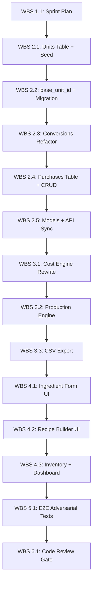
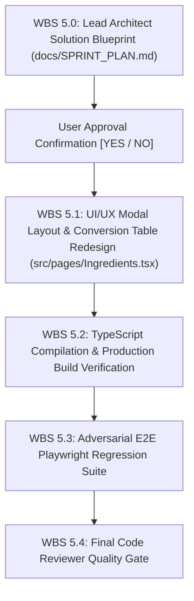
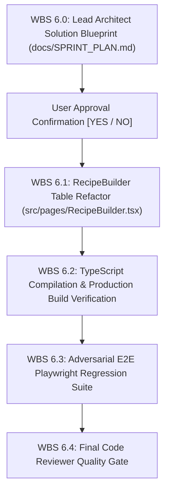

# Sprint Plan: Ingredient-Centric Base-Unit Conversion Engine

**Initiative**: Refactor BakeIQ from Yield-Factor-Based Costing to Base-Unit-Normalized Ingredient Conversion Architecture
**Project**: BakeIQ Desktop Application
**Version**: 2.0.0
**Lead Architect**: `/solution-architect-business-planner`
**Assigned Builder Agents**:
- `/bakeiq-fullstack-engineer` (Phases 1–4: Schema, Models, IPC Commands, Cost Engine, Migration)
- `/frontend-uiux-design-expert` (Phase 5: Ingredient/Recipe/Inventory UI Redesign)
**Assigned Adversarial QA**: `qa-automation-tester` (Phase 6 E2E Playwright Suite)
**Assigned Reviewer**: `code-reviewer` (Final Quality Gate & 3-Strike Abort)
**Source Specification**: [Recipe Pricing Calculator Update.md](file:///d:/source/repos/Pricing%20Calculator%20Application/.vscode/files/Recipe%20Pricing%20Calculator%20Update.md)

---

## 1. Executive Summary

### 1.1 The Architectural Problem

BakeIQ currently uses a **Yield-Factor-Based** costing model:
```text
Normalized Unit Cost = Purchase Price / Yield Factor
Line Item Cost = Batch Qty * Normalized Unit Cost
```

This model conflates the conversion factor (grams per cup) with the package relationship (cups per package) into a single opaque `yield_factor` number. This leads to:
1. **Ambiguous semantics** — users must understand that `yield_factor = 8.33` means "8.33 cups from 1 kg" rather than a physical conversion constant
2. **Inconsistent cross-recipe costs** — the same ingredient with different approximate yield values produces different per-gram costs
3. **Vendor lock-in** — purchase data is welded onto the ingredient entity, preventing multi-supplier comparison

### 1.2 The To-Be Architecture

The new **Base-Unit-Normalized** model separates concerns into distinct, composable layers:

```text
PURCHASE LAYER
  IngredientPurchase: 1 kg @ P50 (PackageQty=1, PackageUnit=kg)
  -> Normalize: 1 kg = 1000g
  -> Base Unit Cost: P50 / 1000g = P0.05/g

CONVERSION LAYER
  IngredientConversion:
    Flour: 1 cup = 125g  (ConversionFactor = 125)
    Flour: 1 tbsp = 7.8g

RECIPE LAYER
  RecipeIngredient:
    Qty=1, Unit=cup
  -> Normalize: 1 cup x 125g/cup = 125g
  -> Cost: 125g x P0.05/g = P6.25
```

**Formulas**:

- Base Unit Cost = Purchase Price / Package Quantity in Base Unit
- Normalized Recipe Qty = Recipe Qty x ConversionFactor
- Ingredient Cost = Normalized Recipe Qty x Base Unit Cost
- Yield Factor (derived) = Package Base Qty / Normalized Recipe Qty

### 1.3 Design Decisions (Confirmed by User)

| # | Decision | Answer |
|---|----------|--------|
| 1 | **Timing** | Replace FIFO sprint — implement this first |
| 2 | **Migration** | Phased column-by-column adoption |
| 3 | **Multi-Supplier** | Fully separate `IngredientPurchases` entity |
| 4 | **Units Table** | Fixed seed, not user-extensible |
| 5 | **Conversion Data** | USDA/standard baking reference values |

---

## 2. Technical Architecture & Data Contracts (Contract-First)

### 2.1 SQLite Schema — New Tables (`src-tauri/src/db.rs`)

```sql
-- TABLE 1: Centralized Units (Fixed Seed)
CREATE TABLE IF NOT EXISTS units (
    unit_id     INTEGER PRIMARY KEY AUTOINCREMENT,
    code        TEXT    NOT NULL UNIQUE,
    name        TEXT    NOT NULL,
    unit_type   TEXT    NOT NULL,
    is_base     INTEGER NOT NULL DEFAULT 0
);

-- TABLE 2: Ingredient Purchases (Separates purchase from identity)
CREATE TABLE IF NOT EXISTS ingredient_purchases (
    purchase_id       INTEGER PRIMARY KEY AUTOINCREMENT,
    ingredient_id     INTEGER NOT NULL REFERENCES ingredients(ingredient_id) ON DELETE CASCADE,
    supplier_name     TEXT,
    package_quantity  REAL    NOT NULL,
    package_unit_id   INTEGER NOT NULL REFERENCES units(unit_id),
    purchase_price    REAL    NOT NULL,
    purchase_date     TEXT    NOT NULL DEFAULT (datetime('now')),
    is_active         INTEGER NOT NULL DEFAULT 1
);

CREATE INDEX IF NOT EXISTS idx_ingredient_purchases_ing
    ON ingredient_purchases(ingredient_id, is_active);
```

### 2.2 SQLite Schema — Column Evolutions

```sql
-- Add base_unit_id to ingredients
ALTER TABLE ingredients ADD COLUMN base_unit_id INTEGER REFERENCES units(unit_id);
ALTER TABLE ingredients ADD COLUMN category TEXT;

-- Add conversion-engine columns to ingredient_conversions
ALTER TABLE ingredient_conversions ADD COLUMN from_unit_id INTEGER REFERENCES units(unit_id);
ALTER TABLE ingredient_conversions ADD COLUMN to_unit_id INTEGER REFERENCES units(unit_id);
ALTER TABLE ingredient_conversions ADD COLUMN conversion_factor REAL;
ALTER TABLE ingredient_conversions ADD COLUMN source TEXT;
ALTER TABLE ingredient_conversions ADD COLUMN effective_date TEXT;
ALTER TABLE ingredient_conversions ADD COLUMN is_active INTEGER NOT NULL DEFAULT 1;

-- Add unit_id to recipe_ingredients
ALTER TABLE recipe_ingredients ADD COLUMN unit_id INTEGER REFERENCES units(unit_id);
```

### 2.3 Units Seed Data

```sql
INSERT OR IGNORE INTO units (code, name, unit_type, is_base) VALUES
    ('g',     'Gram',       'weight', 1),
    ('kg',    'Kilogram',   'weight', 0),
    ('oz',    'Ounce',      'weight', 0),
    ('lb',    'Pound',      'weight', 0),
    ('ml',    'Milliliter', 'volume', 1),
    ('L',     'Liter',      'volume', 0),
    ('tsp',   'Teaspoon',   'volume', 0),
    ('tbsp',  'Tablespoon', 'volume', 0),
    ('cup',   'Cup',        'volume', 0),
    ('pcs',   'Piece',      'count',  1),
    ('pack',  'Pack',       'count',  0),
    ('box',   'Box',        'count',  0),
    ('bottle','Bottle',     'count',  0),
    ('can',   'Can',        'count',  0);
```

### 2.4 System Unit-to-Base Conversions

| From | To | Factor |
|------|----|--------|
| kg | g | 1000 |
| oz | g | 28.3495 |
| lb | g | 453.592 |
| L | ml | 1000 |
| tsp | ml | 4.929 |
| tbsp | ml | 14.787 |
| cup | ml | 236.588 |

> **Note**: Cross-type conversions (cup to g) are always ingredient-specific because they depend on density.

### 2.5 USDA Ingredient-Specific Conversion Seed Data

| Ingredient | From | To | ConversionFactor | Source |
|------------|------|----|------------------|--------|
| All-Purpose Flour | cup | g | 125 | USDA NDB |
| All-Purpose Flour | tbsp | g | 7.8 | USDA NDB |
| All-Purpose Flour | tsp | g | 2.6 | USDA NDB |
| Granulated Sugar | cup | g | 200 | USDA NDB |
| Granulated Sugar | tbsp | g | 12.5 | USDA NDB |
| Granulated Sugar | tsp | g | 4.17 | USDA NDB |
| Brown Sugar (Packed) | cup | g | 213 | USDA NDB |
| Unsalted Butter | cup | g | 227 | USDA NDB |
| Unsalted Butter | tbsp | g | 14.2 | USDA NDB |
| Cocoa Powder | cup | g | 100 | USDA NDB |
| Whole Milk | cup | ml | 240 | USDA NDB |
| Vegetable Oil | cup | ml | 240 | USDA NDB |
| Vanilla Extract | tsp | ml | 5 | USDA NDB |
| Baking Powder | tsp | g | 5 | USDA NDB |
| Baking Soda | tsp | g | 5 | USDA NDB |
| Large Eggs | pcs | pcs | 1 | Identity |

---

## 3. Domain Model Contracts (Rust & TypeScript)

### 3.1 Rust Structs (`src-tauri/src/models.rs`)

```rust
// New: Unit Entity
#[derive(Debug, Serialize, Deserialize, Clone, PartialEq)]
pub struct Unit {
    pub unit_id: i64,
    pub code: String,
    pub name: String,
    pub unit_type: String,  // "weight" | "volume" | "count"
    pub is_base: bool,
}

// Refactored: IngredientConversion
#[derive(Debug, Serialize, Deserialize, Clone, PartialEq)]
pub struct IngredientConversion {
    pub conversion_id: i64,
    pub ingredient_id: i64,
    // Legacy fields (kept during phased migration)
    pub recipe_unit: String,
    pub yield_factor: f64,
    // New conversion-engine fields
    pub from_unit_id: Option<i64>,
    pub to_unit_id: Option<i64>,
    pub conversion_factor: Option<f64>,
    pub source: Option<String>,
    pub effective_date: Option<String>,
    pub is_active: bool,
}

// New: IngredientPurchase
#[derive(Debug, Serialize, Deserialize, Clone)]
pub struct IngredientPurchase {
    pub purchase_id: i64,
    pub ingredient_id: i64,
    pub supplier_name: Option<String>,
    pub package_quantity: f64,
    pub package_unit_id: i64,
    pub purchase_price: f64,
    pub purchase_date: String,
    pub is_active: bool,
}

#[derive(Debug, Serialize, Deserialize, Clone)]
pub struct IngredientPurchaseInput {
    pub supplier_name: Option<String>,
    pub package_quantity: f64,
    pub package_unit_id: i64,
    pub purchase_price: f64,
}

// Evolved: Ingredient (adds base_unit_id, keeps legacy)
#[derive(Debug, Serialize, Deserialize, Clone)]
pub struct Ingredient {
    pub ingredient_id: i64,
    pub name: String,
    // Legacy fields (kept during phased migration)
    pub purchase_unit: String,
    pub purchase_price: f64,
    pub recipe_unit: String,
    pub yield_factor: f64,
    pub package_type: String,
    pub net_quantity: f64,
    pub net_unit: String,
    pub current_stock_qty: f64,
    pub reorder_threshold: f64,
    pub supplier: Option<String>,
    pub sku: Option<String>,
    pub conversions: Vec<IngredientConversion>,
    // New fields
    pub base_unit_id: Option<i64>,
    pub category: Option<String>,
    pub purchases: Vec<IngredientPurchase>,
}

// New: Cost Calculation DTO
#[derive(Debug, Serialize, Deserialize, Clone)]
pub struct RecipeIngredientCostResult {
    pub ingredient_id: i64,
    pub ingredient_name: String,
    pub recipe_quantity: f64,
    pub recipe_unit_code: String,
    pub normalized_quantity: f64,
    pub base_unit_code: String,
    pub package_quantity: f64,
    pub package_unit_code: String,
    pub purchase_price: f64,
    pub base_unit_cost: f64,
    pub ingredient_cost: f64,
    pub yield_factor: f64,  // derived
}

// Pure helper: system unit normalization
pub fn normalize_to_base_unit(qty: f64, from_unit_code: &str, base_unit_code: &str) -> f64 {
    if from_unit_code == base_unit_code { return qty; }
    match (from_unit_code, base_unit_code) {
        ("kg", "g")   => qty * 1000.0,
        ("oz", "g")   => qty * 28.3495,
        ("lb", "g")   => qty * 453.592,
        ("L",  "ml")  => qty * 1000.0,
        _ => qty,
    }
}
```

### 3.2 TypeScript Interfaces (`src/lib/api.ts`)

```typescript
export interface Unit {
  unit_id: number;
  code: string;
  name: string;
  unit_type: 'weight' | 'volume' | 'count';
  is_base: boolean;
}

export interface IngredientConversion {
  conversion_id: number;
  ingredient_id: number;
  recipe_unit: string;
  yield_factor: number;
  from_unit_id?: number | null;
  to_unit_id?: number | null;
  conversion_factor?: number | null;
  source?: string | null;
  effective_date?: string | null;
  is_active: boolean;
}

export interface IngredientPurchase {
  purchase_id: number;
  ingredient_id: number;
  supplier_name?: string | null;
  package_quantity: number;
  package_unit_id: number;
  purchase_price: number;
  purchase_date: string;
  is_active: boolean;
}

export interface IngredientPurchaseInput {
  supplier_name?: string | null;
  package_quantity: number;
  package_unit_id: number;
  purchase_price: number;
}

export interface RecipeIngredientCostResult {
  ingredient_id: number;
  ingredient_name: string;
  recipe_quantity: number;
  recipe_unit_code: string;
  normalized_quantity: number;
  base_unit_code: string;
  package_quantity: number;
  package_unit_code: string;
  purchase_price: number;
  base_unit_cost: number;
  ingredient_cost: number;
  yield_factor: number;
}

// New IPC Wrappers
export const getUnits = () =>
  invoke<Unit[]>("get_units");

export const getIngredientPurchases = (ingredientId: number) =>
  invoke<IngredientPurchase[]>("get_ingredient_purchases", { ingredientId });

export const createIngredientPurchase = (ingredientId: number, input: IngredientPurchaseInput) =>
  invoke<IngredientPurchase>("create_ingredient_purchase", { ingredientId, input });

export const updateIngredientPurchase = (purchaseId: number, input: IngredientPurchaseInput) =>
  invoke<void>("update_ingredient_purchase", { purchaseId, input });

export const deleteIngredientPurchase = (purchaseId: number) =>
  invoke<void>("delete_ingredient_purchase", { purchaseId });
```

---

## 4. Work Breakdown Structure (DAG WBS)



---

## 5. Phased Task Breakdown

### Phase 1: Foundation — Units & Base Unit Identity

**Agent**: `/bakeiq-fullstack-engineer`

#### WBS 2.1 — Units Table + Seed Data

**Target**: `src-tauri/src/db.rs`

- Create `units` table with DDL from section 2.1
- Seed 14 fixed units from section 2.3
- Add `get_units` IPC command returning `Vec<Unit>` sorted by `unit_type`, `name`
- Register `commands::get_units` in `lib.rs` invoke handler

**Unit Tests**:
- Verify 14 units seeded with correct `unit_type` and `is_base` flags
- Verify idempotent re-seeding (`INSERT OR IGNORE`)
- Verify `get_units` returns complete sorted list

**Acceptance Criteria**:
```gherkin
Given a fresh database initialization
When the units table is queried
Then exactly 14 units exist
And 3 units have is_base = 1 (g, ml, pcs)
And unit_type distribution is: 4 weight, 5 volume, 5 count
```

#### WBS 2.2 — base_unit_id on Ingredients + Auto-Migration

**Target**: `db.rs`, `models.rs`, `commands.rs`

- Add `base_unit_id` and `category` columns via safe `ALTER TABLE`
- Auto-populate `base_unit_id` for existing ingredients:
  - Weight-based (Flour, Sugar, Butter, Powder, Soda) -> g
  - Volume-based (Milk, Cream, Oil, Extract, Vanilla) -> ml
  - Count-based (Egg) -> pcs
- Update `get_ingredients` and `create_ingredient` to include `base_unit_id`

**Unit Tests**:
- Existing 7 unit tests in models.rs must continue passing
- New: verify all 11 seed ingredients receive correct `base_unit_id`
- New: verify `base_unit_id` is included in `get_ingredients` response

---

### Phase 2: Conversion Engine Refactor

**Agent**: `/bakeiq-fullstack-engineer`

#### WBS 2.3 — IngredientConversions Refactor + ConversionFactor

**Target**: `db.rs`, `commands.rs`

- Add `from_unit_id`, `to_unit_id`, `conversion_factor`, `source`, `effective_date`, `is_active` columns
- Auto-populate from USDA reference data (section 2.5)
- Keep legacy `recipe_unit` and `yield_factor` columns intact
- Update CRUD commands to read/write both legacy and new fields

**Unit Tests**:
- Verify `conversion_factor` values match USDA table
- Verify round-trip: `from_unit_id` -> `to_unit_id` -> `conversion_factor` stored correctly
- Verify `is_active = false` conversions excluded from cost calculations
- Verify legacy `yield_factor` still readable alongside new fields

---

### Phase 3: Purchase Entity Separation

**Agent**: `/bakeiq-fullstack-engineer`

#### WBS 2.4 — IngredientPurchases Table + CRUD Commands

**Target**: `db.rs`, `commands.rs`

- Create `ingredient_purchases` table from section 2.1
- Auto-migrate existing purchase data from `ingredients` table (only where `purchase_price > 0`)
- Implement 4 new IPC commands: `get_ingredient_purchases`, `create_ingredient_purchase`, `update_ingredient_purchase`, `delete_ingredient_purchase`
- Register all 4 in `lib.rs` invoke handler

**Unit Tests**:
- Verify auto-migration populates `ingredient_purchases` from existing data
- Verify multi-purchase: 2 suppliers for same ingredient
- Verify `get_ingredient_purchases` returns only active records
- Verify deletion sets `is_active = 0`

#### WBS 2.5 — Rust Models + TypeScript API Contract Sync

**Target**: `models.rs`, `api.ts`

- Add all new structs from section 3.1 to `models.rs`
- Add all new interfaces and IPC wrappers from section 3.2 to `api.ts`
- Ensure strict 1:1 field symmetry

**Verification**:
```bash
cd pricing-calculator/src-tauri && cargo check --tests
cd pricing-calculator && npx tsc --noEmit
```

---

### Phase 4: Cost Engine Rewrite

**Agent**: `/bakeiq-fullstack-engineer`

#### WBS 3.1 — Cost Engine: Base-Unit Normalization

**Target**: `commands.rs` — `calculate_recipe_cost` function

Replace current yield-factor math:
```rust
// OLD
let normalized_unit_cost = purchase_price / yield_factor;
let line_item_cost = batch_qty * normalized_unit_cost;
```

With 3-step base-unit pipeline:
```rust
// Step 1: Normalize package to base units (e.g., 1 kg -> 1000g)
let package_base_qty = normalize_to_base_unit(package_qty, package_unit_code, base_unit_code);
let base_unit_cost = purchase_price / package_base_qty;

// Step 2: Convert recipe qty to base units (e.g., 1 cup flour -> 125g)
let normalized_recipe_qty = if recipe_unit == base_unit {
    recipe_qty
} else {
    recipe_qty * conversion_factor
};

// Step 3: Calculate cost
let ingredient_cost = normalized_recipe_qty * base_unit_cost;

// Step 4: Derive yield (informational)
let yield_factor = package_base_qty / normalized_recipe_qty;
```

**Unit Tests**:
- Flour: 1 cup from 1 kg @ P50 -> 125g x P0.05/g = P6.25
- Sugar: 1/4 cup from 1 kg @ P50 -> 50g x P0.05/g = P2.50
- Flour: 150g from 1 kg @ P50 -> 150g x P0.05/g = P7.50 (no conversion)
- Butter: 1/2 cup from 225g box @ P120 -> 113.5g x P0.5333/g = P60.53
- Eggs: 2 pcs from 12 pcs @ P96 -> 2 x P8.00 = P16.00
- Derived yield: Flour 1000g / 125g = 8.0 cups/package

#### WBS 3.2 — Production Engine Base-Unit Adaptation

**Target**: `commands.rs` — `produce_batch_with_validation`

- Replace: `bulk_needed = (batch_qty * batches) / yield_factor`
- With: `base_qty_needed = (recipe_qty * conversion_factor) * batches`, compare against stock in base units

#### WBS 3.3 — CSV Export Adaptation

**Target**: `commands.rs` — `export_data_csv`

- Update CSV header: replace "Yield Factor" with "Conversion Factor" and "Base Unit Cost"
- Update calculation to use base-unit normalization pipeline

---

### Phase 5: UI/UX Redesign

**Agent**: `/frontend-uiux-design-expert`

#### WBS 4.1 — Ingredient Form UI Redesign

**Target**: `src/pages/Ingredients.tsx`

- Replace free-text `purchase_unit` with Unit dropdown (from `getUnits()`)
- Add `Base Unit` selector (filtered to `is_base = true`: g, ml, pcs)
- Replace yield_factor input with `Conversion Factor` input
- Add `Purchase Records` sub-section with add/edit/delete
- Show derived yield factor as read-only computed display

#### WBS 4.2 — Recipe Builder UI Adaptation

**Target**: `src/pages/RecipeBuilder.tsx`

- Replace conversion_id-based unit selection with Unit dropdown
- Show both original recipe quantity AND normalized base quantity (e.g., "1 cup -> 125g")
- Display `Base Unit Cost` column instead of `Normalized Unit Cost`
- Display derived yield factor informational badge

#### WBS 4.3 — Inventory & Dashboard UI Updates

**Target**: `src/pages/Inventory.tsx`, `src/pages/Dashboard.tsx`, `src/components/ReceiveDeliveryModal.tsx`

- Update Inventory ledger to source price from `ingredient_purchases`
- Update Receive Delivery modal to create `IngredientPurchase` record
- Update Dashboard KPIs to use base-unit cost calculations

---

## 6. Validation Rules

The cost engine must validate before calculating:

```text
VALID:   Flour + cup -> g   (conversion exists)
INVALID: Flour + cup -> ml  (no cross-type conversion without ingredient-specific mapping)
INVALID: Sugar + cup -> g   (only if sugar cup->g conversion is missing)
```

Error message template:
```text
No conversion is configured for:
  Ingredient = {ingredient_name}
  From Unit = {recipe_unit_code}
  To Unit = {base_unit_code}

Please configure an ingredient-specific conversion.
```

---

## 7. Verification Commands

```bash
cd pricing-calculator/src-tauri && cargo check --tests && cargo test --lib
cd pricing-calculator && npx tsc --noEmit
cd pricing-calculator && npm run build
cd pricing-calculator && npx playwright test
```

---

## 8. Migration Safety Matrix

| Risk | Mitigation |
|------|------------|
| Existing ingredient data lost | Legacy columns kept alongside new columns |
| Old yield-factor math silently wrong | Dual-mode: engine checks `conversion_factor` first, falls back to `yield_factor` |
| Unit mapping failures | Default fallback: if `base_unit_id IS NULL`, use legacy path |
| Purchase migration gap | `ingredient_purchases` auto-populated only when price > 0 |
| Recipe builder breaks | `recipe_ingredients.unit_id` nullable; legacy `conversion_id` path remains |

---

## 9. Rollback Plan

```bash
git restore pricing-calculator/src-tauri/src/db.rs \
           pricing-calculator/src-tauri/src/commands.rs \
           pricing-calculator/src-tauri/src/models.rs \
           pricing-calculator/src-tauri/src/lib.rs \
           pricing-calculator/src/lib/api.ts \
           pricing-calculator/src/pages/Ingredients.tsx \
           pricing-calculator/src/pages/RecipeBuilder.tsx \
           pricing-calculator/src/pages/Inventory.tsx \
           pricing-calculator/src/pages/Dashboard.tsx \
           pricing-calculator/src/components/ReceiveDeliveryModal.tsx
git clean -fd
```

> Because all new columns use safe `ALTER TABLE ADD COLUMN` migrations and the legacy columns are never dropped, the SQLite database remains backward-compatible even after partial execution.

---

## 10. Sprint Execution Status & Quality Gate Sign-Off (Sprint 2.0: Base-Unit Engine)

### Phase 1–5 WBS Deliverables: `[COMPLETED]`
- [x] **WBS 2.1**: Centralized `units` table created & seeded with 14 culinary units (3 canonical base units).
- [x] **WBS 2.2**: `base_unit_id` & `category` evolved on `ingredients` table with automatic legacy migration.
- [x] **WBS 2.3**: `ingredient_conversions` evolved with `from_unit_id`, `to_unit_id`, `conversion_factor`, `source`, `is_active`, and seeded with USDA reference standards.
- [x] **WBS 2.4**: Multi-supplier `ingredient_purchases` entity created with full CRUD IPC handlers.
- [x] **WBS 2.5**: Rust models (`models.rs`) and TypeScript API bridge (`api.ts`) synchronized with strict 1:1 type symmetry.
- [x] **WBS 3.1**: Dual-mode 3-step base-unit normalization calculation engine implemented in `calculate_recipe_cost`.
- [x] **WBS 3.2**: Production deduction adapted in `produce_batch_with_validation`.
- [x] **WBS 3.3**: CSV data export adapted in `export_data_csv`.
- [x] **WBS 4.1**: `src/pages/Ingredients.tsx` redesigned with canonical base unit selector, bidirectional conversion factor & yield factor editing, and purchase history card.
- [x] **WBS 4.2**: `src/pages/RecipeBuilder.tsx` enhanced with Base Unit Cost column and live normalized quantity display (`≈ 125.0 g`).

### Phase 6: Adversarial QA & End-to-End Verification (`qa-automation-tester`)
- **Suite**: `pricing-calculator/e2e/base_unit_conversion_engine.spec.ts` + Full Regression Suite
- **Result**: `16 passed (22.1s)`
- **Status**: `STATUS: PASSED`

### Phase 7: Strict Code Review Gate (`code-reviewer`)
- **Remnants**: Zero `console.log`, `debugger`, `print!`, `println!`, or `dbg!` in production code.
- **Compiler Health**: `cargo check --tests` (0 warnings, 0 errors), `npm run build` (0 errors).
- **Strike Count**: 0 strikes.
- **Status**: `STATUS: APPROVED`

---

# Sprint 2.1: Ingredient Modal UI/UX Modernization & Conversion Rules Table Architecture

**Initiative**: Overhaul Add / Edit Ingredient Modal layout, ergonomics, and visual design to eliminate cramped column clipping, replace generic AI-generated aesthetics with an executive artisanal design system, and balance complex multi-unit conversion tables.  
**Lead Architect**: `/solution-architect-business-planner`  
**Assigned Execution Agent**: `/frontend-uiux-design-expert` (UI/UX Engineering & Modernization)  
**Assigned Adversarial QA**: `qa-automation-tester` (Playwright E2E Regression)  
**Assigned Code Reviewer**: `code-reviewer` (Final Quality Gate & 3-Strike Abort)  

---

## 11. Sprint 2.1 Architectural Blueprint & Design System

### 11.1 Problem Statement & Ergonomic Gaps
1. **Modal Sizing Constriction**: The current modal wrapper in `pricing-calculator/src/pages/Ingredients.tsx` is clamped at `max-w-3xl` (768px). Accounting for container padding (`p-6 md:p-8`), usable width is only ~700px.
2. **Table Density Clashing**: The 5-column `Inline Editable Conversion Rules Table` requires at least 820px of horizontal breathing room to display:
   - Kitchen Recipe Unit dropdown + Primary indicator badge
   - Conversion Factor input + base unit denominator tag (`g / Cup`)
   - Yield Factor input + package ratio tag (`Cups / Bag`)
   - Normalized Micro-Cost with high-visibility currency formatting
   - Action controls (Delete rule button)
   Inside 768px, inputs clip, unit labels wrap onto secondary lines, and table headers cramp together.
3. **"Typically AI-Made" Visual Archetypes**:
   - Monotonous vertical tube hierarchy (all sections stacked blindly in a single column).
   - Flat, disconnected cards with repetitive gray borders and zero tactile elevation.
   - Disorganized packaging vs. base-unit inputs without visual grouping or clear computational causality.

### 11.2 To-Be Information Architecture & Ergonomic Layout
The redesigned modal introduces a balanced, executive multi-tier layout:
```text
┌────────────────────────────────────────────────────────────────────────────────────────┐
│ MODAL HEADER: Title, Breadcrumb Metadata, Dismiss Trigger                             │
├────────────────────────────────────────────────────────────────────────────────────────┤
│ TIER 1: IDENTITY & TAXONOMY (2-Column Grid)                                           │
│   [ Ingredient Name (w-2/3) ]                       [ Category Selector (w-1/3) ]     │
│   [ Supplier / Brand (Optional) ]                   [ SKU / Location (Optional) ]     │
├────────────────────────────────────────────────────────────────────────────────────────┤
│ TIER 2: BALANCED PROCUREMENT & UNIT ECONOMIC BASIS (Side-by-Side Cards on lg:)         │
│   ┌────────────────────────────────────────┐ ┌────────────────────────────────────────┐│
│   │ CARD A: Packaging & Physical Mass     │ │ CARD B: Economic Engine & Base Unit    ││
│   │ - Container Type (Box, Bag, Sack)      │ │ - Canonical Base Unit Selector         ││
│   │ - Net Quantity + Secondary UOM         │ │ - Live Effective Cost per Net Unit     ││
│   │ - Invoice Purchase Price (₱)           │ │ - Normalization Foundation Badge       ││
│   └────────────────────────────────────────┘ └────────────────────────────────────────┘│
├────────────────────────────────────────────────────────────────────────────────────────┤
│ TIER 3: FULL-WIDTH MASTER-DETAIL CONVERSION MATRIX (The Core Feature)                  │
│   - Header Bar: Title + Context Subtitle + [Auto-Generate Conversions] + [+ Add Rule] │
│   - Expanded Table (max-w-5xl/6xl) with Calibrated Column Proportions:                │
│     • Kitchen Recipe Unit: 24% (Custom select, soft ring, Primary badge)              │
│     • Conversion Factor:   24% (Tactile input with integrated pill suffix)             │
│     • Yield Factor:        24% (Derived input with integrated package ratio suffix)    │
│     • Micro-Cost:          20% (Right-aligned, tabular emerald typography)            │
│     • Action:               8% (Centered icon button with soft hover transition)       │
│   - Quick Culinary Presets: Segmented pill toolbar with hover micro-elevation         │
├────────────────────────────────────────────────────────────────────────────────────────┤
│ TIER 4: SUMMARY & HISTORICAL INTELLIGENCE                                              │
│   - Calculated Recipe Cost Hero Ribbon (Artisanal dark/light contrast)                │
│   - Multi-Supplier Purchase History Sub-table (if records exist)                      │
├────────────────────────────────────────────────────────────────────────────────────────┤
│ FOOTER: Sticky Actions (Cancel, Save & Add Another, Save Ingredient)                  │
└────────────────────────────────────────────────────────────────────────────────────────┘
```

### 11.3 Design Standards & Non-AI Aesthetics
- **Container Scale**: `max-w-5xl lg:max-w-6xl w-full` with ergonomic responsive gutters.
- **Color Palette & Contrast**: Deep slate backgrounds (`bg-white dark:bg-[#0c101a]`), subtle borders (`border-slate-200/90 dark:border-slate-800`), refined emerald accents (`text-emerald-600 dark:text-emerald-400`), and tabular numerics (`tabular-nums font-semibold tracking-tight`).
- **Tactile Inputs**: Consistent `h-[42px]` inputs with subtle inner shadow, distinct focus rings (`focus:ring-2 focus:ring-emerald-500/20 focus:border-emerald-500`), and unified font styling.
- **Defensive UI & Empty States**: Meaningful tooltips, non-wrapping badges, and zero horizontal scroll within the modal on standard 1080p+ viewports.

### 11.4 Work Breakdown Structure (DAG WBS)



#### WBS 5.1 — UI/UX Modal Layout & Conversion Table Redesign: `[COMPLETED]`
- **Assigned Agent**: `/frontend-uiux-design-expert`
- **Target File**: `pricing-calculator/src/pages/Ingredients.tsx`
- **Status**: Completed.
  - Modal container upgraded to `max-w-5xl xl:max-w-6xl w-full` with ergonomic responsive gutters.
  - Balanced two-column procurement & economic engine cards for Packaging, Net Mass, Purchase Price, and Base Unit selector.
  - 5-column `Inline Editable Conversion Rules Table` expanded with calibrated column widths (`24% / 25% / 25% / 18% / 8%`).
  - Integrated custom input groups with unit badges (`g / Cup`, `Cups / Bag`), preventing text wrapping and column clipping.
  - Retained 100% of existing Playwright test IDs and text matchers.

#### WBS 5.2 — Compilation & Verification: `[COMPLETED]`
- Commands: `npx tsc --noEmit` and `npm run build`
- Result: 0 warnings, 0 errors.

#### WBS 5.3 — Adversarial E2E Playwright Suite: `[COMPLETED]`
- Commands: `npx playwright test`
- Result: 16 passed in 21.1s.

#### WBS 5.4 — Code Reviewer Quality Gate: `[APPROVED]`
- Remnant Audit: Zero `console.log` statements in modified files.
- Strike Count: 0 strikes recorded in `.review_strikes.log`.
- Status: `STATUS: APPROVED`.


---

# Sprint 2.2: Recipe Builder Table Streamlining & Yield Factor Ergonomic Demotion

**Initiative**: Streamline the ingredients line items table in `RecipeBuilder.tsx` by removing the redundant top-level `Yield Factor (Derived)` column and embedding package yield into clean contextual subtext under the ingredient metadata.  
**Lead Architect**: `/solution-architect-business-planner`  
**Assigned Execution Agent**: `/frontend-uiux-design-expert` (UI/UX Engineering & Modernization)  
**Assigned Adversarial QA**: `qa-automation-tester` (Playwright E2E Regression)  
**Assigned Code Reviewer**: `code-reviewer` (Final Quality Gate & 3-Strike Abort)  

---

## 12. Sprint 2.2 Architectural Blueprint & Design System

### 12.1 Problem Statement & Ergonomic Rationale
1. **Semantic Conflict**: The column name "Yield Factor (Derived)" clashes with the recipe's own batch yield (e.g. 24 Pandesals vs 8.0 Cups/pack), confusing users during formula editing.
2. **Horizontal Table Squeezing**: Having 3 consecutive cost derivation columns (`Purchase Price`, `Yield Factor`, `Base & Unit Cost`) pushes the primary interactive input (`Recipe Qty`) and the bottom-line (`Line Cost`) too far to the right.
3. **Engine Alignment**: Under the v2.0 Base-Unit engine, Yield Factor is no longer the costing divisor. Demoting it to secondary subtext aligns the UI with modern DDD architecture.

### 12.2 To-Be Table Structure
- **Columns (6 columns total)**:
  1. `Ingredient` (Left-aligned, expansive, showing name + badge + packaging info with `• 8.0 Cups/pack` subtext)
  2. `Purchase Price` (Right-aligned, tabular)
  3. `Base & Unit Cost` (Right-aligned, showing recipe unit cost and canonical base rate)
  4. `Recipe Qty` (Center-aligned, showing interactive numeric input + unit dropdown + normalized mass `≈ 125.0 g`)
  5. `Line Cost` (Right-aligned, highlighted bold)
  6. `Action` (Delete icon)
- Empty state: `colSpan={6}`.

### 12.3 Work Breakdown Structure (DAG WBS)



#### WBS 6.1 — RecipeBuilder Table Refactor: `[COMPLETED]`
- **Assigned Agent**: `/frontend-uiux-design-expert`
- **Target File**: `pricing-calculator/src/pages/RecipeBuilder.tsx`
- **Status**: Completed.
  - Removed `<th className="text-right py-3 px-3">Yield Factor (Derived)</th>` from `<thead>`.
  - Adjusted empty state `colSpan` from 7 to 6.
  - Removed the standalone `Yield Factor` `<td>` in `displayItems.map()`.
  - Embedded package yield into the ingredient subtext under the ingredient name:
    `{li.yield_factor > 0 && <span> • {li.yield_factor.toFixed(1)} {li.recipe_unit}s/pack</span>}`.
  - Preserved all existing Playwright test IDs and text contracts (`Base & Unit Cost`, `Base: ₱0.05/g`, `≈ 125.0 g`).

#### WBS 6.2 — Compilation & Verification: `[COMPLETED]`
- Commands: `npx tsc --noEmit` and `npm run build`
- Result: 0 warnings, 0 errors.

#### WBS 6.3 — Adversarial E2E Playwright Suite: `[COMPLETED]`
- Commands: `npx playwright test`
- Result: 16 passed in 24.7s.

#### WBS 6.4 — Code Reviewer Quality Gate: `[APPROVED]`
- Remnant Audit: Zero `console.log` statements in modified files.
- Strike Count: 0 strikes recorded in `.review_strikes.log`.
- Status: `STATUS: APPROVED`.

---


