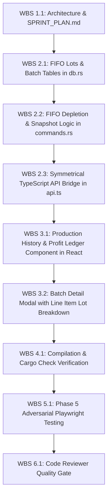

# Sprint Plan: FIFO Physical Stock Depletion & Immutable Batch Production Profit Ledger

**Initiative**: FIFO Inventory Lot Tracking, Actual Production Cost Freezing, & Historical Profit Monitoring  
**Project**: BakeIQ Desktop Application  
**Version**: 1.7.0  
**Lead Architect**: `/solution-architect-business-planner`  
**Assigned Builder Agents**:  
- `/bakeiq-fullstack-engineer` (Phase 1: SQLite schema, FIFO lot consumption engine, batch run snapshot persistence, Tauri IPC)  
- `/frontend-uiux-design-expert` (Phase 2: Production Run History & Profit Monitoring UI, Batch detail modal, FIFO lot inspector)  
**Assigned Adversarial QA**: `qa-automation-tester` (Phase 5 E2E Playwright Suite)  
**Assigned Reviewer**: `code-reviewer` (Final Quality Gate & 3-Strike Abort)  
**Workspace Path**: `docs/SPRINT_PLAN.md`  

---

## 1. Executive Summary & Problem Analysis

### 1.1 The Business Problem
Currently, BakeIQ calculates recipe costs using **Live Replacement Costing (LRC)**: recipes join directly with `ingredients.purchase_price`. While this is ideal for menu pricing and inflation quotation:
1. **Historical Profit Distortion**: When an ingredient price changes (e.g., Sugar rises from ₱80/kg to ₱95/kg), previously produced batches appear more expensive retroactively. This corrupts financial reports and distorts past profit monitoring.
2. **Premature Price Impact**: In physical bakery operations, a price hike from a new delivery invoice should **not** impact costs immediately if old physical stock bought at the lower price is still sitting in the pantry. New prices should only reflect in production **once the physical older stock is actually consumed**.

### 1.2 The To-Be Solution Architecture
To solve this, BakeIQ establishes a dual-engine architecture:
- **Menu Pricing Engine (Quotation)**: Continues using Live Replacement Cost (LRC) to recommend current retail and wholesale prices for future sales.
- **Production Costing Engine (Actual FIFO COGS)**: Tracks physical stock in **FIFO Inventory Lots**. When a batch is produced:
  1. Ingredients are consumed from the oldest physical lots first.
  2. The exact acquisition cost of the consumed lots is locked into an **Immutable Batch Production Snapshot**.
  3. Historical batches and past profit margins are permanently frozen and immune to future ingredient price inflation.

---

## 2. Technical Architecture & Data Contracts (Contract-First)

### 2.1 SQLite Schema Evolutions (`src-tauri/src/db.rs`)

```sql
-- 1. FIFO Inventory Stock Lots (Tracks individual deliveries and acquisition costs)
CREATE TABLE IF NOT EXISTS inventory_lots (
    lot_id              INTEGER PRIMARY KEY AUTOINCREMENT,
    ingredient_id       INTEGER NOT NULL REFERENCES ingredients(ingredient_id) ON DELETE CASCADE,
    received_qty        REAL    NOT NULL,
    remaining_qty       REAL    NOT NULL,
    unit_cost           REAL    NOT NULL, -- Acquisition cost per bulk unit
    received_at         TEXT    NOT NULL DEFAULT (datetime('now'))
);

CREATE INDEX IF NOT EXISTS idx_inventory_lots_fifo 
    ON inventory_lots(ingredient_id, remaining_qty, received_at ASC);

-- 2. Batch Production Run Ledger (Immutable snapshot of every production run)
CREATE TABLE IF NOT EXISTS batch_production_runs (
    batch_run_id        INTEGER PRIMARY KEY AUTOINCREMENT,
    recipe_id           INTEGER NOT NULL REFERENCES recipes(recipe_id),
    recipe_name         TEXT    NOT NULL,
    batches_produced    REAL    NOT NULL,
    yield_qty_total     REAL    NOT NULL,
    total_ingredient_cost REAL  NOT NULL, -- Actual FIFO cost applied
    total_overhead_cost REAL    NOT NULL, -- Labor + electricity + other overhead
    total_batch_cost    REAL    NOT NULL,
    unit_cost           REAL    NOT NULL,
    unit_selling_price  REAL    NOT NULL,
    realized_gross_profit REAL  NOT NULL,
    realized_margin_pct REAL    NOT NULL,
    produced_at         TEXT    NOT NULL DEFAULT (datetime('now'))
);

-- 3. Batch Production Item Cost Snapshots (Detailed line-item breakdown per batch)
CREATE TABLE IF NOT EXISTS batch_production_items (
    id                  INTEGER PRIMARY KEY AUTOINCREMENT,
    batch_run_id        INTEGER NOT NULL REFERENCES batch_production_runs(batch_run_id) ON DELETE CASCADE,
    ingredient_id       INTEGER NOT NULL,
    ingredient_name     TEXT    NOT NULL,
    qty_used            REAL    NOT NULL,
    recipe_unit         TEXT    NOT NULL,
    actual_cost_applied REAL    NOT NULL -- Exact dollar/peso cost consumed from FIFO lots
);
```

### 2.2 Domain Mathematical Models (`src-tauri/src/models.rs`)

```rust
#[derive(Debug, Serialize, Deserialize, Clone)]
pub struct InventoryLot {
    pub lot_id: i64,
    pub ingredient_id: i64,
    pub received_qty: f64,
    pub remaining_qty: f64,
    pub unit_cost: f64,
    pub received_at: String,
}

#[derive(Debug, Serialize, Deserialize, Clone)]
pub struct BatchProductionRun {
    pub batch_run_id: i64,
    pub recipe_id: i64,
    pub recipe_name: String,
    pub batches_produced: f64,
    pub yield_qty_total: f64,
    pub total_ingredient_cost: f64,
    pub total_overhead_cost: f64,
    pub total_batch_cost: f64,
    pub unit_cost: f64,
    pub unit_selling_price: f64,
    pub realized_gross_profit: f64,
    pub realized_margin_pct: f64,
    pub produced_at: String,
}

#[derive(Debug, Serialize, Deserialize, Clone)]
pub struct BatchProductionItem {
    pub id: i64,
    pub batch_run_id: i64,
    pub ingredient_id: i64,
    pub ingredient_name: String,
    pub qty_used: f64,
    pub recipe_unit: String,
    pub actual_cost_applied: f64,
}
```

### 2.3 Symmetrical TypeScript API Contracts (`src/lib/api.ts`)

```typescript
export interface InventoryLot {
  lot_id: number;
  ingredient_id: number;
  received_qty: number;
  remaining_qty: number;
  unit_cost: number;
  received_at: string;
}

export interface BatchProductionRun {
  batch_run_id: number;
  recipe_id: number;
  recipe_name: string;
  batches_produced: number;
  yield_qty_total: number;
  total_ingredient_cost: number;
  total_overhead_cost: number;
  total_batch_cost: number;
  unit_cost: number;
  unit_selling_price: number;
  realized_gross_profit: number;
  realized_margin_pct: number;
  produced_at: string;
}

export interface BatchProductionItem {
  id: number;
  batch_run_id: number;
  ingredient_id: number;
  ingredient_name: string;
  qty_used: number;
  recipe_unit: string;
  actual_cost_applied: number;
}

export const getProductionHistory = () =>
  invoke<BatchProductionRun[]>("get_production_history");

export const getProductionBatchItems = (batchRunId: number) =>
  invoke<BatchProductionItem[]>("get_production_batch_items", { batchRunId });
```

---

## 3. Work Breakdown Structure (DAG WBS)



### 3.1 Task Breakdown

#### Phase 1: Logic & Database Engine (`/bakeiq-fullstack-engineer`)
- **WBS 2.1**: Add `inventory_lots`, `batch_production_runs`, and `batch_production_items` tables with migrations in [`db.rs`](file:///d:/source/repos/Pricing%20Calculator%20Application/pricing-calculator/src-tauri/src/db.rs).
- **WBS 2.2**: 
  - Update `receive_inventory`: Insert new record into `inventory_lots`.
  - Update `produce_batch_with_validation`:
    1. Consume stock from `inventory_lots` using strict FIFO (`received_at ASC`).
    2. Compute exact material cost from consumed lots.
    3. Persist frozen snapshot in `batch_production_runs` and `batch_production_items`.
  - Add IPC query commands: `get_production_history` and `get_production_batch_items`.
- **WBS 2.3**: Mirror all structs and IPC command callers symmetrically in [`api.ts`](file:///d:/source/repos/Pricing%20Calculator%20Application/pricing-calculator/src/lib/api.ts).

#### Phase 2: UI/UX & Profit Monitoring (`/frontend-uiux-design-expert`)
- **WBS 3.1**: Create `ProductionHistoryLedger.tsx` view inside the Inventory / Recipe dashboard displaying historical runs, frozen unit costs, and immutable profit percentages.
- **WBS 3.2**: Add Batch Run Detail Modal showing the exact ingredients, quantities, and lot costs applied at the time of baking.

#### Phase 3: Adversarial E2E Attack (`qa-automation-tester`)
- **WBS 5.1**:
  - Attack Vector 1: Produce Batch #1 with ₱80 Sugar. Receive delivery of ₱95 Sugar. Assert Batch #1 profit does NOT change.
  - Attack Vector 2: Multi-lot FIFO split: Produce batch that consumes 2 kg from a 1 kg remaining lot @ ₱80 and 1 kg from next lot @ ₱95. Assert blended cost basis is exactly ₱175.00.

#### Phase 4: Code Review Gate (`code-reviewer`)
- **WBS 6.1**: Static analysis, zero debug remnants, 0 clippy warnings, zero float precision drift.

---

## 4. Verification Commands & Telemetry

```bash
cd pricing-calculator/src-tauri && cargo check --tests
cd ../ && npm run build
npx playwright test
```

---

## 5. Rollback Plan

```bash
git checkout pricing-calculator/src-tauri/src/db.rs pricing-calculator/src-tauri/src/commands.rs pricing-calculator/src-tauri/src/models.rs pricing-calculator/src/lib/api.ts
git clean -fd
```
